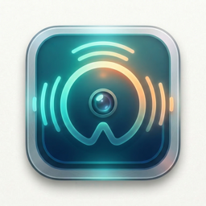

  

<h1 align="center">Ambient Witness</h1>

  A macOS screen capture daemon that builds a searchable visual timeline of everything you do on your computer.

  <a href="https://github.com/thieso2/AmbientWitness/releases/latest">Download</a>

---

## What is Ambient Witness?

Ambient Witness runs quietly in the background on your Mac, continuously recording display frames, running OCR on what's on screen, and collecting system metadata — giving you a complete, searchable record of your computing history.

Think of it as a flight recorder for your desktop.

## Features

- **Continuous screen capture** — snapshots display frames as JPEG images, assembled into HLS (fMP4) segments for efficient storage and playback
- **OCR pipeline** — extracts text from keyframes using Apple's Vision framework, so you can search for anything you've seen on screen
- **System metadata collection** — records active windows, apps, browser tabs, power state, audio playback, Wi-Fi, location, and user activity
- **Browser extension** — deep integration with Chromium browsers (Chrome, Brave, Edge, Dia, Arc, Vivaldi) captures tab navigation, focus spans, and page interactions
- **MCP server** — exposes captured data via Model Context Protocol so AI assistants can query your timeline
- **Privacy-first** — all data stays on your machine in `~/Library/Application Support/Engram/data/`
- **Power-aware** — media assembly runs only on AC power to preserve battery life

## Requirements

- macOS 15.0 (Sequoia) or later
- `ffmpeg` on PATH (for media assembly)

## Install

1. Download the latest `.zip` from [Releases](https://github.com/thieso2/AmbientWitness/releases/latest)
2. Unzip and move `Ambient Witness.app` to `/Applications`
3. Launch and grant the requested permissions (Screen Recording, Accessibility, Location)

## Permissions

Ambient Witness needs three system permissions to function:

| Permission | Why |
|---|---|
| **Screen Recording** | Capture display frames for the visual timeline |
| **Accessibility** | Read window titles, browser tabs, and app state |
| **Location** | Record where you work and read Wi-Fi network names |

## Example Prompts

With the MCP server connected to your AI assistant, you can ask natural-language questions about your day:

### Productivity
- *How many hours did I spend productively at the computer today?*
- *How was my day divided — which projects/apps got how much time?*
- *What did I commit to Git today?*

### Focus & Concentration
- *How often did I switch apps per hour today?*
- *When was my longest uninterrupted work session?*
- *Was today a good or bad focus day for me?*

### Browsing
- *Which websites did I spend the most time on today?*
- *How much of my browser time was on documentation vs. consumption?*
- *Which pages did I visit multiple times today?*

### Communication
- *How much time went into Slack, Signal, WhatsApp, and Messages today?*
- *Which Slack conversations did I have today?*
- *Which chats interrupted my work most frequently?*

### Knowledge & Learning
- *What did I search on Google today?*
- *Which documentation did I read today?*
- *What did I ask ChatGPT or Claude today?*

### Media & Audio
- *Which songs did I listen to today, and for how long each?*
- *Was music playing during my deep work blocks or during distractions?*
- *When did I switch from speakers to AirPods?*

### Context & Location
- *Which Wi-Fi networks was I connected to today?*
- *Where was I today — which locations and for how long?*
- *Which meetings did I have, and what was I doing between them?*

### Distraction & ADHD
- *How much time went into social media today?*
- *Show me my hyperfocus pattern: when was I absorbed in something for too long?*
- *How often did I impulsively switch apps (< 30 seconds per window)?*

### Daily Report
- *Create my daily report: overview, what I accomplished, focus quality, distractions, communication, learning, and one tip for tomorrow.*

### Visual Context
- *Which error messages did I have on screen today? Show me the screenshots.*
- *Find the most important screenshots from my last hour.*

> See the full catalog of 160+ prompts in [PROMPTS-en.md](https://github.com/thieso2/Engram/blob/main/PROMPTS-en.md) (English) and [PROMPTS.md](https://github.com/thieso2/Engram/blob/main/PROMPTS.md) (German).

## Data & Privacy

All captured data is stored locally in date-partitioned directories under `~/Library/Application Support/Engram/data/`. Nothing is uploaded anywhere. The browser extension includes configurable domain blocklists, query string redaction, and incognito exclusion.

## License

Proprietary. All rights reserved.
